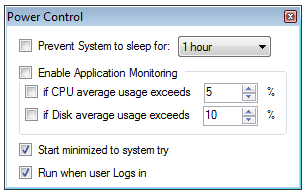

# PowerControl
Windows Program to disable temporarily the system to sleep. Minimizing to System Tray.

Very usefull if you have long-running activities in Programs which do not prevent the 
system to sleep, like e.g. OneDrive downloading 100 GB.

 

## Attention!
Application Monitoring is not implemented. Only duration.